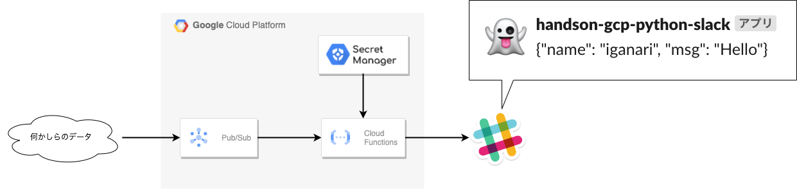
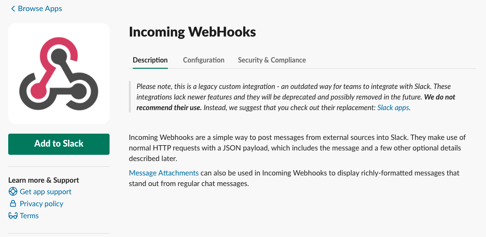
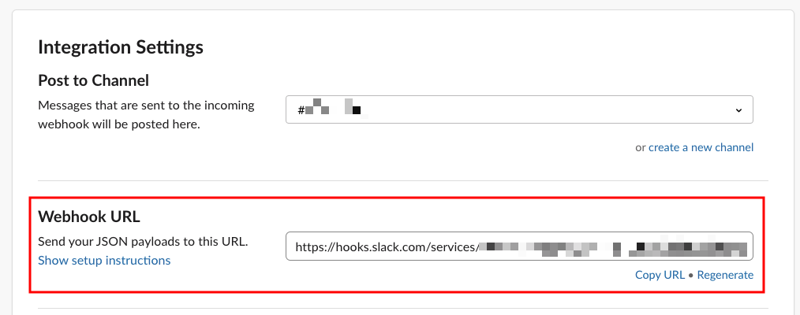
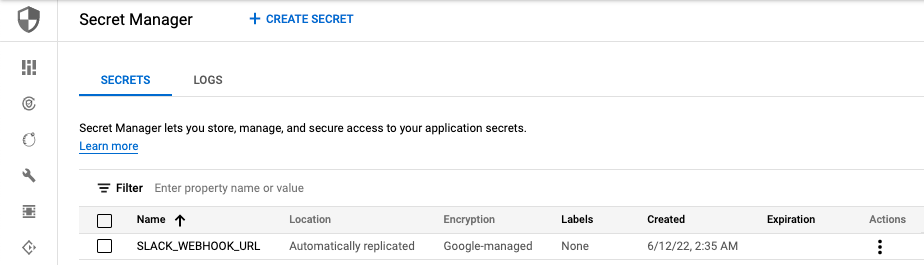
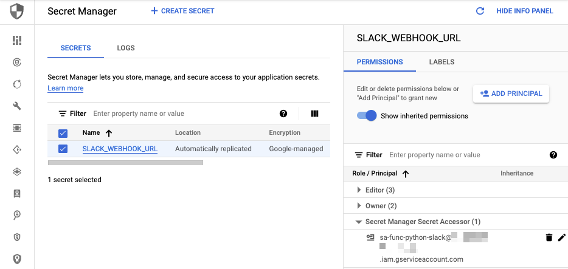
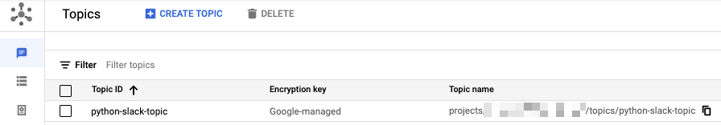
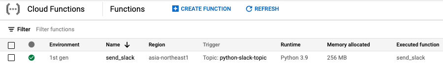
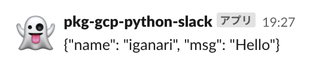

# Pub/Sub に来たデータを Slack の特定のチャンネルに投稿する

## 概要

Pub/Sub に来たデータを Slack の特定のチャンネルに投稿できるようにします



## ハンズオン

## 1. Incoming Webhook の作成

Incoming WebHooks





--> Webhook URL を取得しておきます

## 2. 準備

+ CLI の環境変数として設定しておきます

```
export _gcp_pj_id='Your GCP Project ID'
export _region='asia-northeast1'
export _common='python-slack'
export _slack_webhook_url='1 で取得しておいた Incoming Webhook の Webhook URL を入れる'
```

## 3. Secret Manager の作成

+ Secret Manager に Slack の Incoming Webhook を格納しておきます

```
echo -n "${_slack_webhook_url}" | gcloud beta secrets create SLACK_WEBHOOK_URL --data-file=- --project ${_gcp_pj_id}
```




## 4. IAM の設定

+ Service Account を作成します

```
gcloud beta iam service-accounts create sa-func-${_common} --project ${_gcp_pj_id}
```

+ 作成した Service Account が Secret Manager `SLACK_WEBHOOK_URL` のみにアクセス出来るように IAM Role を付与します

```
gcloud beta secrets add-iam-policy-binding SLACK_WEBHOOK_URL \
  --member="serviceAccount:sa-func-${_common}@${_gcp_pj_id}.iam.gserviceaccount.com" \
  --role="roles/secretmanager.secretAccessor" \
  --project ${_gcp_pj_id}
```



## 5. Pub/Sub の作成

+ Pub/Sub の Topic を作成します

```
gcloud beta pubsub topics create ${_common}-topic --project ${_gcp_pj_id}
```



## 6. Cloud Functions のデプロイ

+ Cloud Functions をデプロイする
  + Service Account の指定
  + 環境変数として Secret Manager の Secret を指定

```
gcloud beta functions deploy send_slack \
  --entry-point send_slack \
  --region ${_region} \
  --runtime python39 \
  --source ./src \
  --trigger-topic ${_common}-topic \
  --service-account sa-func-${_common}@${_gcp_pj_id}.iam.gserviceaccount.com \
  --set-secrets _SLACK_WEBHOOK_URL=projects/${_gcp_pj_id}/secrets/SLACK_WEBHOOK_URL:latest \
  --project ${_gcp_pj_id}
```



## 7. Pub/Sub 経由でメッセージの送信 ( 値が入っている JSON )

+ CLI で Topic にメッセージを送ってみます

```
gcloud beta pubsub topics publish ${_common}-topic \
  --message="{\"name\": \"iganari\", \"msg\": \"Hello\"}" \
  --project ${_gcp_pj_id}
```

+ Incoming Webhook で設定した Slack のチャンネルに以下のようにメッセージが来たら成功です :)



---> Pub/Sub に来たデータを Slack の特定のチャンネルに投稿出来ました!! :)

## Closing

ハンズオンを通じて Pub/Sub に来たデータを Slack の特定のチャンネルに投稿出来るようになりました

これを応用していくことで、Google Cloud の様々な通知を Slack に集約することが出来そうです ;)

Have Fan!! :)

### リソースの削除

実験が終わったら今回作成したリソースを削除しましょう! :D

<details>
<summary>Details</summary>


+ Cloud Functions の削除を削除します

```
gcloud beta functions delete send_slack \
  --region ${_region} \
  --project ${_gcp_pj_id} \
  -q
```

+ Pub/Sub の Topic の削除します

```
gcloud beta pubsub topics delete ${_common}-topic --project ${_gcp_pj_id}
```

+ Secret を削除します

```
gcloud beta secrets delete SLACK_WEBHOOK_URL --project ${_gcp_pj_id}
```

+ Service Account を削除します

```
gcloud beta iam service-accounts delete sa-func-${_common}@${_gcp_pj_id}.iam.gserviceaccount.com --project ${_gcp_pj_id}
```

</details>
