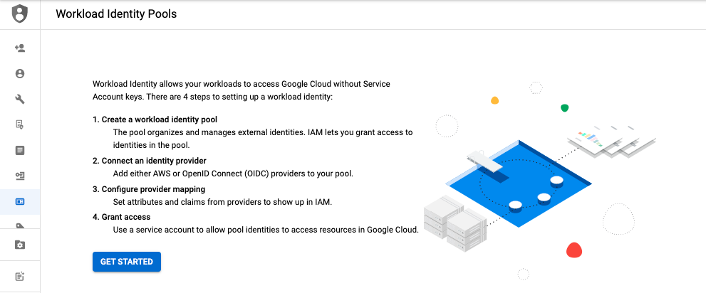

# GitHub Actions

## 概要


OIDC をサポートしていて、 GitHub Actions も OIDC を使えるようになったので。

```
Workload Identity 連携
https://cloud.google.com/iam/docs/workload-identity-federation
```
```
GitHub Actions からのキーなしの認証の有効化
https://cloud.google.com/blog/ja/products/identity-security/enabling-keyless-authentication-from-github-actions
```
```
GitHub | auth
https://github.com/google-github-actions/auth
```




## 手順

以下の N 個の手順が必要になる

1. 使用する Service Account を作成
1. Workload Identity プールの作成
1. Workload Identity プロバイダの作成
1. Workload Identity 連携を設定および構成

```
export _gcp_pj_id='Your GCP Project ID'   ## GCP Project の ID


export _common='handsongcp-wif-github'
# export _workload_identity_pool_id='handsongcp-wif-github'  
export _github_repos='iganari/handson-gcp'                 ## GitHub の Repository の固有の URL の末尾

```

+ GCP と認証する

```
gcloud auth login --no-launch-browser -q
```

## 1. 使用する Service Account を作成

+ GCP の IAM にて Service Account を作成する

```
gcloud beta iam service-accounts create ${_common}-sa \
  --display-name="HandsonGCP Workload Identity Federation GitHub" \
  --description="https://github.com/iganari/package-gcp" \
  --project "${_gcp_pj_id}"
```

+ 作成した Service Account の確認をする

```
gcloud beta iam service-accounts list \
  --filter="${_common}-sa" \
  --project "${_gcp_pj_id}"
```

+ [WIP] Role を付与する
  + 無難に Viewer ( `roles/viewer` ) の権限をつける

```
gcloud beta projects add-iam-policy-binding ${_gcp_pj_id} \
  --member="serviceAccount:${_common}-sa@${_gcp_pj_id}.iam.gserviceaccount.com" \
  --role='roles/viewer'
```

## 2. Workload Identity プールの作成

```
gcloud beta iam workload-identity-pools create ${_common}-pool \
  --location global \
  --display-name="Hands On GCP" \
  --project "${_gcp_pj_id}"
```

+ 確認

```
gcloud beta iam workload-identity-pools describe ${_common}-pool \
  --location global \
  --project "${_gcp_pj_id}" \
  --format json
```
```
gcloud beta iam workload-identity-pools describe ${_common}-pool \
  --location global \
  --project "${_gcp_pj_id}" \
  --format="value(name)"
```

+ `WORKLOAD_IDENTITY_POOL_ID` なるものが必要になる
  + GCP コンソールから見ると `ID` の表記があるが、これでは無いらしい
  + 今回 `ID` として使うのは name で取得できるもの 

```
export _workload_identity_pool_id=$(gcloud beta iam workload-identity-pools describe ${_common}-pool \
  --location global \
  --project "${_gcp_pj_id}" \
  --format="value(name)")
```

+ 確認

```
echo ${_workload_identity_pool_id}
```
--> 01.png 01.mp4

## 3. Workload Identity プロバイダの作成

```
gcloud beta iam workload-identity-pools providers create-oidc ${_common}-provider \
  --location global \
  --workload-identity-pool ${_common}-pool \
  --display-name="Hands On GCP provider" \
  --attribute-mapping="google.subject=assertion.sub,attribute.actor=assertion.actor,attribute.aud=assertion.aud" \
  --issuer-uri="https://token.actions.githubusercontent.com" \
  --project "${_gcp_pj_id}"
```

---> ここまで

02, movie と png

## 4. Workload Identity 連携を設定および構成


```
gcloud beta iam service-accounts add-iam-policy-binding "${_common}-sa@${_gcp_pj_id}.iam.gserviceaccount.com" \
  --role="roles/iam.workloadIdentityUser" \
  --member="principalSet://iam.googleapis.com/${_workload_identity_pool_id}/attribute.repository/${_github_repos}" \
  --project="${_gcp_pj_id}"
```

---> ここまで


movie


## 1. 

```
steps:
- id: 'auth'
  name: 'Authenticate to Google Cloud'
  uses: 'google-github-actions/auth@v0.4.0'
  with:
    workload_identity_provider: 'projects/123456789/locations/global/workloadIdentityPools/my-pool/providers/my-provider'
    service_account: 'my-service-account@my-project.iam.gserviceaccount.com'
```
```
steps:
- id: auth
  uses: google-github-actions/auth@v0.4.0
  with:
    workload_identity_provider: 'projects/123456789/locations/global/workloadIdentityPools/my-pool/providers/my-provider'
    service_account: 'my-service-account@my-project.iam.gserviceaccount.com'

- id: get-gke-credentials
  uses: google-github-actions/get-gke-credentials@v0.4.0
  with:
    cluster_name: my-cluster
    location: us-central1-a

- id: get-pods
  run: kubectl get pods
```

## memo

他の有用なブログなど

```
https://dev.classmethod.jp/articles/google-cloud-auth-with-workload-identity/
https://zenn.dev/vvakame/articles/gha-and-gcp-workload-identity
```